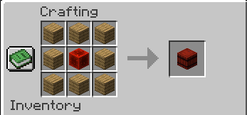

  <h1>📦 Stackable Barrels</h1>
  
<i>Expand your storage limits by stacking barrels vertically!</i>

<h2>📖 Sobre o Mod</h2>

  O <b>Stackable Barrels</b> é um mod para Minecraft (Fabric 1.20.6) que permite empilhar barris verticalmente para criar silos de armazenamento. 
  Ao abrir qualquer barril de uma pilha, você terá acesso a um <b>inventário combinado</b> contendo todos os itens de todos os barris conectados, 
  eliminando a necessidade de abrir cada barril individualmente.

<h2>🚀 Funcionalidades Principais</h2>
<ul>
  <li><b>Empilhamento Infinito:</b> Coloque barris uns sobre os outros para expandir a capacidade.</li>
  <li><b>Interface Dinâmica:</b> Uma única tela com barra de rolagem que se adapta ao tamanho total da torre.</li>
  <li><b>Sistema de Busca Avançado:</b>
    <ul>
      <li>Pesquisa por nome do item.</li>
      <li>Filtro por Mod: Use <code>@modid</code> (ex: <code>@minecraft</code>).</li>
      <li>Filtro por Tag: Use <code>#tag</code> (ex: <code>#logs</code>).</li>
    </ul>
  </li>
  <li><b>Compatibilidade Técnica:</b>
    <ul>
      <li>Implementação de <code>SidedInventory</code> para suporte nativo a Funis (Hoppers).</li>
      <li>Integração com <code>Fabric Transfer API</code> para compatibilidade com mods de logística.</li>
    </ul>
  </li>
  <li><b>Contador de Ocupação:</b> Visualize rapidamente quantos slots estão preenchidos no total.</li>
</ul>

<h2>🛠️ Receita de Crafting</h2>

  
   
  <i>(Adicione a imagem da sua receita aqui)</i>

<h2>💻 Detalhes Técnicos</h2>
<ul>
  <li><b>Versão do Minecraft:</b> 1.20.6</li>
  <li><b>Loader:</b> Fabric</li>
  <li><b>Linguagem:</b> Java 21</li>
</ul>

  

    <i>Este código foi parcialmente desenvolvido e revisado por <b>Inteligência Artificial</b>.</i>
  

