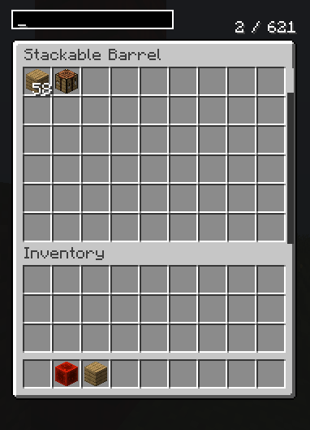
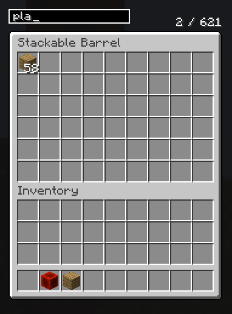

  <h1>📦 Stackable Barrels</h1>

<h2>📖 Sobre o Mod</h2>

  O <b>Stackable Barrels</b> é um mod para Minecraft (Fabric 1.20.6) que permite empilhar barris verticalmente para criar verdadeiros silos de armazenamento.
  Ao abrir qualquer barril da pilha, você acessa um <b>inventário unificado</b>, contendo todos os itens dos barris conectados, sem precisar abrir individualmente

<h2>Funcionalidades</h2>
<ul>
  <li><b>Empilhamento Vertical:</b> Expanda seu armazenamento simplesmente empilhando barris.</li>
  <li><b>Inventário Unificado:</b> Todos os barris funcionam como um único container.</li>
  <li><b>Interface com Scroll:</b> UI adaptável ao tamanho da pilha.</li>
  <li><b>Busca Avançada:</b>
    <ul>
      <li>Por nome do item</li>
      <li>Por mod: <code>@modid</code></li>
      <li>Por tag: <code>#tag</code></li>
    </ul>
  </li>
  <li><b>Compatível com Automação:</b>
    <ul>
      <li>Suporte a Hoppers (<code>SidedInventory</code>)</li>
      <li>Integração com Fabric Transfer API</li>
    </ul>
  </li>
  <li><b>Contador de Slots:</b> Visualização rápida de ocupação total.</li>
</ul>

<h2>Demonstração</h2>

  
  

<h2>🛠️ Receita de Crafting</h2>

  

<h2>💻 Detalhes Técnicos</h2>
<ul>
  <li><b>Minecraft:</b> 1.20.6</li>
  <li><b>Loader:</b> Fabric</li>
  <li><b>Linguagem:</b> Java 21</li>
</ul>

  
<i>Projeto desenvolvido com auxílio de Inteligência Artificial.</i>

